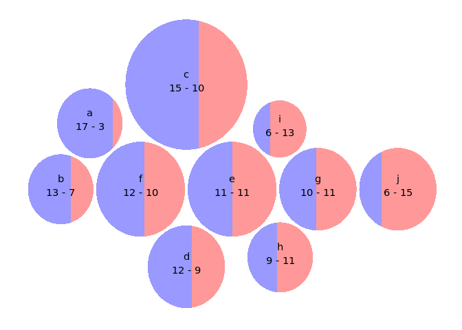

<!-- README.md is generated from README.Rmd. Please edit that file -->
``` r
library(dplyr)
#> 
#> Attaching package: 'dplyr'
#> The following objects are masked from 'package:stats':
#> 
#>     filter, lag
#> The following objects are masked from 'package:base':
#> 
#>     intersect, setdiff, setequal, union
library(bubblewordchart)
df <- data_frame(
  qt1 = 1:10 + rbinom(10,10,0.5),
  qt2 = 10:1 + rbinom(10,10,0.5),
  palavra = letters[1:10]
)

bubblewordchart(df, "palavra", "qt1", "qt2")
```

<!-- -->
